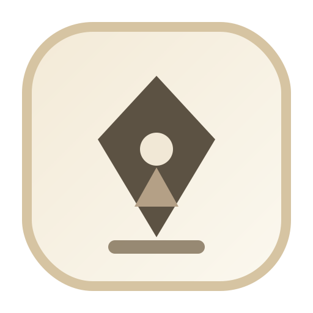

  

<h1 align="center">Mini Author .app</h1>

  A clean writing space for long-form work. Open it, write, and stay focused.

## What It Is

Mini Author .app is made for authors who want a calm, minimal writing flow:

- one long writing canvas
- simple text styling
- no clutter while you write
- your work saved automatically
- optional Dropbox connection for syncing

You can use it fully without connecting Dropbox.

## What You Can Do

- Write in one continuous manuscript.
- Use one main `Title`, plus `Heading 1`, `Heading 2`, and regular paragraph text.
- Format text with **Bold** and *Italic*.
- Jump through your story using the outline/map panel.
- Export your work as:
  - one full Markdown file
  - split Markdown files by Heading 1 sections
- Use light or dark mode.

## Menus and Focus Mode

- Menus stay hidden while you write.
- Press `Esc` to open/close the side menu.
- Floating buttons appear when needed and fade when idle.
- On phones, menus open in full-screen for easier use.

## Autosave and Offline Use

- Your writing is saved automatically while you work.
- You can keep writing even without internet.
- When you reconnect, you can sync to Dropbox.

## Dropbox Sync (Optional)

If you connect Dropbox:

- your manuscript syncs to Dropbox
- you can sync manually anytime with `Cmd/Ctrl + S`
- the app can sync again when you come back online

### If There Is a Sync Conflict

Sometimes you edit the same part in two places.  
When that happens, Mini Author .app opens a clear review screen where you can choose, for each change:

- `Take from Dropbox`
- `Take Local`
- `Take Both`

You can also apply one choice to everything at once.

## Keyboard Shortcuts

- `Esc`: open/close menu
- `Cmd/Ctrl + S`: sync now
- `Cmd/Ctrl + B`: bold
- `Cmd/Ctrl + I`: italic
- `Cmd/Ctrl + 1`: Heading 1
- `Cmd/Ctrl + 2`: Heading 2
- `Cmd/Ctrl + 3`: Paragraph
- `Cmd/Ctrl + A`: select the current block

## Quick Start

1. Open Mini Author .app.
2. Add your title.
3. Start writing in the first paragraph block.
4. Press `Esc` whenever you need menu options.
5. Optionally connect Dropbox and sync.

## Version

`1.1.0`
